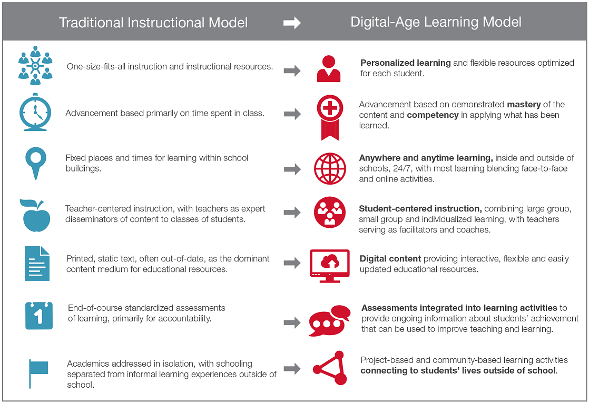
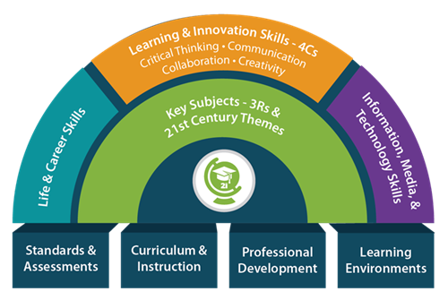

This unit will explore the definition and origins of the term "digital learning". At the core, the term "digital learning" has evolved into shorthand for the transition from the "traditional" model of education to a model that aims to disrupt this model by leveraging emerging technologies. This includes a wide array of ideas, from simply using laptops in classrooms to radically redefining some of the basic tentpoles of our education system such as the [Carnegie Unit](https://www.carnegiefoundation.org/faqs/carnegie-unit/) or placing students in grade levels or requiring students to attend school in a physical building.

The [Alliance for Excellent Education](https://digitallearningday.org/about-dlday/), a non-profit organization that promotes digital and personalized learning (and also coordinates National Digital Learning Day), defines "digital learning" as: 
>Digital learning is any instructional practice that effectively uses technology to strengthen a student’s learning experience. It emphasizes high-quality instruction and provides access to challenging content, feedback through formative assessment, opportunities for learning anytime and anywhere, and individualized instruction to ensure all students reach their full potential to succeed in college and a career.

The [North Carolina Digital Learning Plan](ncdli.fi.ncsu.edu/dlplan/) further operationalized this definition by comparing traditional learning models with digital-age learning models:

The North Carolina Digital Learning Plan uses the term "Digital-Age Learning" in lieu of "Digital Learning". This was an intentional choice to reflect that technology is only a part of what students will need to be successful in the modern world. While student will need to be able to both use and understand how technology works, they will also need to be critical consumers of information (though [kids are much more skeptical consumers of information](https://www.commonsensemedia.org/news-and-media-literacy/do-tweens-and-teens-believe-fake-news) than adults are), adjust to [changing workplaces](https://hbr.org/1998/05/the-alternative-workplace-changing-where-and-how-people-work), navigate [blurring lines between work and home life](https://www.forbes.com/sites/shelcyvjoseph/2019/10/17/forget-work-life-balance-try-achieving-work-life-blend-instead/#68eae943d946), and be able to solve [fuzzier interdisciplinary problems](https://www.careerbuilder.com/advice/what-are-problemsolving-skills-and-why-are-they-important) (more recently referred to as Computational Thinking) routinely. As workplaces become more global and demographics in the United States continue to shift, cultural awareness and the ability to work with diverse groups of people becomes increasingly important. Mechanization in factories means that students who work in factories will need to understand how the machines working alongside them work. Agriculture continues to become mechanized and automated, but students who work in agriculture will also have access to vast and increasing amounts of data (such as from [Fitbits for cows](https://www.zdnet.com/article/building-iot-for-the-industry-technology-left-behind/)) and will need to have the data science skills to crunch and understand these datasets. From listening to music to cooking to banking to coal mining to farming, there are very few corners of society that are unaffected by the digital revolution. In 2009, the Partnership for 21st Century Skills created their first framework that defined the skills and processes schools would need to address for students to be successful in the digital age. The Batelle Foundation has taken over this projet and has [since revised the framework](http://www.battelleforkids.org/networks/p21). The framework now addresses the core skills students need to be successful (Life & Career Skills; Learning and Innovation Skills (including the 4 C's - Critical Thinking, Collaboration, Communication, and Creativity); Information, Media, and Technology Skills; along with core content ), and the building blocks that schools will need to address in order to meet this need (Standards & Assessment; Curriculum & instruction; Professional Development; and Learning Environments).

 <cite class="text-center">Source: Batelle Foundation</cite>

There are a lot of open questions about this type of digital-age transformation in schools. Many digital-learning initiatives have collapsed because of funding issues or lack of planning or community buy-in. Many people believe that children spend too much time attached to screens outside of school, and that [too much screen time is detrimental](https://www.theatlantic.com/education/archive/2018/11/screen-time-backlash/567934/) to their development. Some studies have claimed that [students learn better when technology is not used](https://www.educationnext.org/should-professors-ban-laptops-classroom-computer-use-affects-student-learning-study/), but other studies [refute this claim](https://www.brookings.edu/blog/brown-center-chalkboard/2019/05/08/is-technology-good-or-bad-for-learning/). There are also significant questions about how these types of digital transitions [create inequities between schools](https://www.insidehighered.com/digital-learning/blogs/technology-and-learning/technology-driving-educational-inequality) and [further inequities within schools](http://www.ascd.org/publications/educational-leadership/feb19/vol76/num05/Teaching-Our-Way-to-Digital-Equity.aspx).

In practice, there is no right answer. The questions of how much technology should be used, when, where, and why will vary widely from community to community and from school to school. The "how and why" will be the content in this course. The North Carolina Digital Learning Plan identified five "enabling conditions" and created a [rubric](https://ncdli.fi.ncsu.edu/rubric/) that need to be addressed for a locally-responsive digital-age learning program to succeed:
* Leadership and Vision
* Human Capacity and Professional Learning
* Digital Content and Instruction
* Technology and Infrastructure
* Data and Assessment

The [Future Ready Initiative](https://futureready.org/ourwork/future-ready-frameworks/) launched in November 14 as a partnership between the US Department of Education, the Alliance for Excellent Education, the Friday Institute, Common Sense Education, the Learning Accelerator, Digital Promise, and the LEAD Commission. The goal of Future Ready was to get schools, districts, and states to take a ["Future Ready Pleadge"](https://futureready.org/thenetwork/take-the-pledge/) to transition to digital-age learning opportunities. They identified eight major areas of focus to build a successful program:
* Curriculum, Instruction, and Assessment
* Personalized Professional Learning
* Budget and Resources
* Community Partnerships
* Data and Privacy
* Robust Infrastructure
* Use of Space and Time
